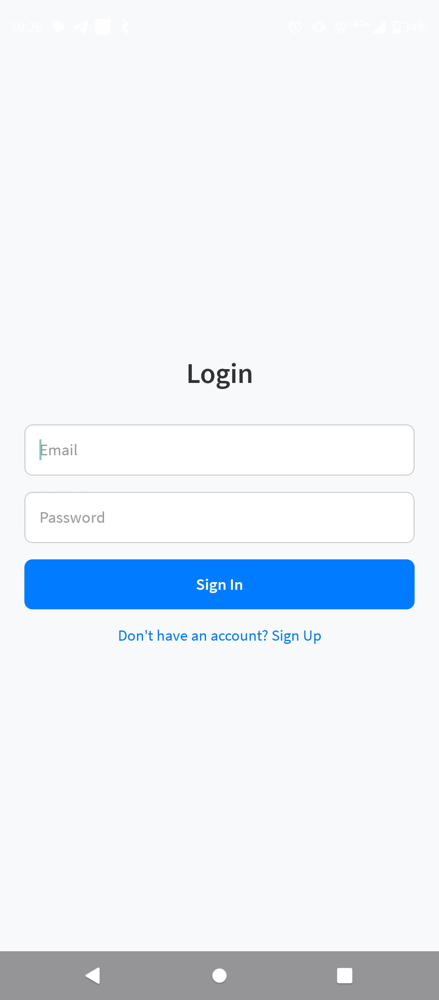
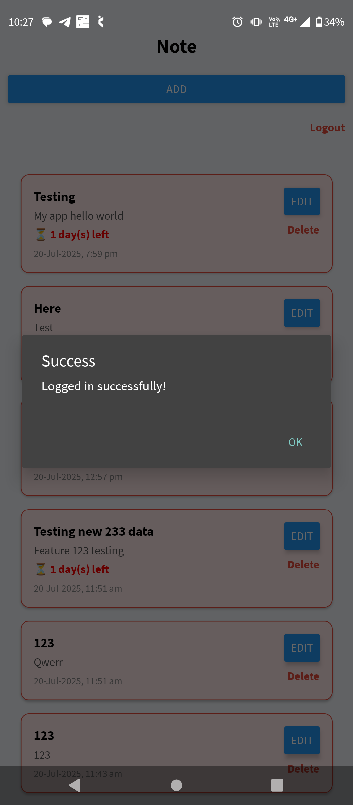
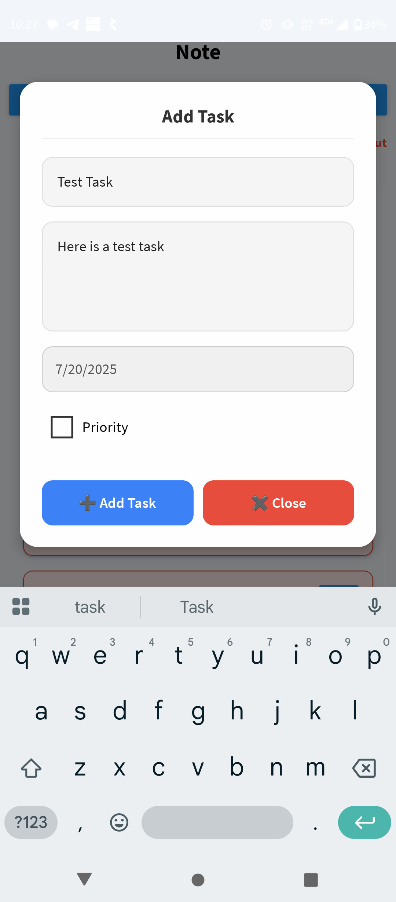
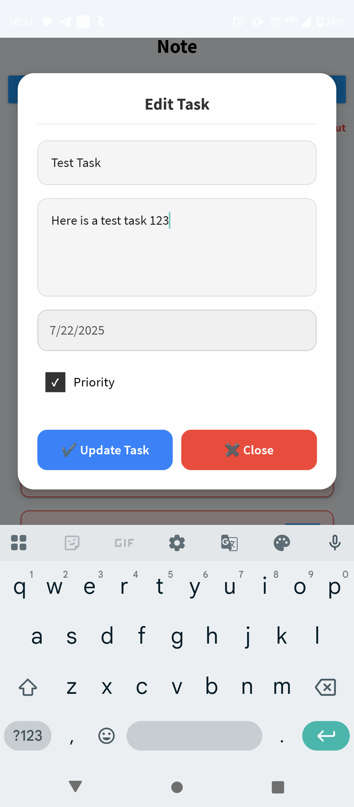
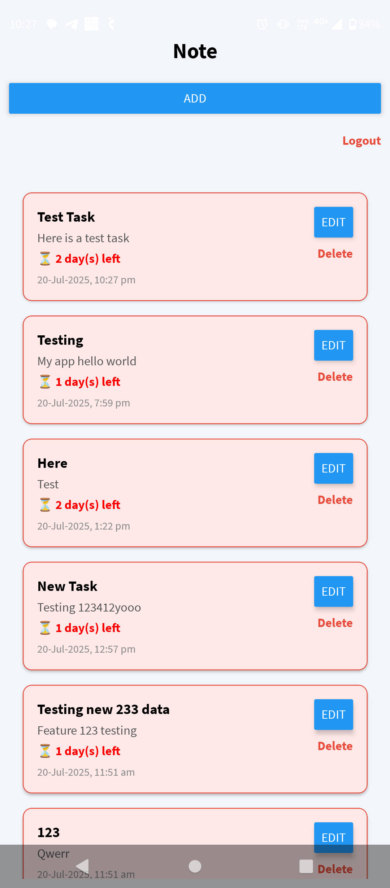

# Welcome to your Expo app 👋

This is an [Expo](https://expo.dev) project created with [`create-expo-app`](https://www.npmjs.com/package/create-expo-app).

## Get started

1. Install dependencies

   ```bash
   npm install
   ```

2. Start the app

   ```bash
   npx expo start
   ```

## 📱 App Features

   🔐 Login Screen – Secure entry point to the app.
   ✅ Task List – View all your tasks at a glance with status indicators.
   ➕ Add Task Modal – Add new tasks with title, description, and optional deadline.
   ✏️ Edit Task Modal – Edit existing tasks to update details or mark them as completed.
   📅 Deadline Support – Keep track of important task deadlines.

## Images
<p float="left">
  
  
  
  
  
</p>
